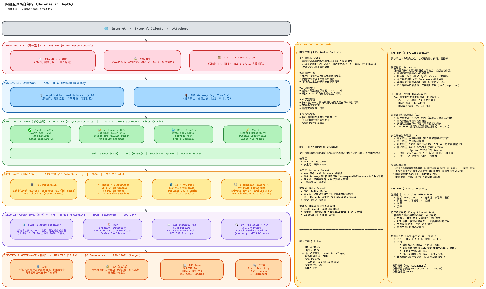
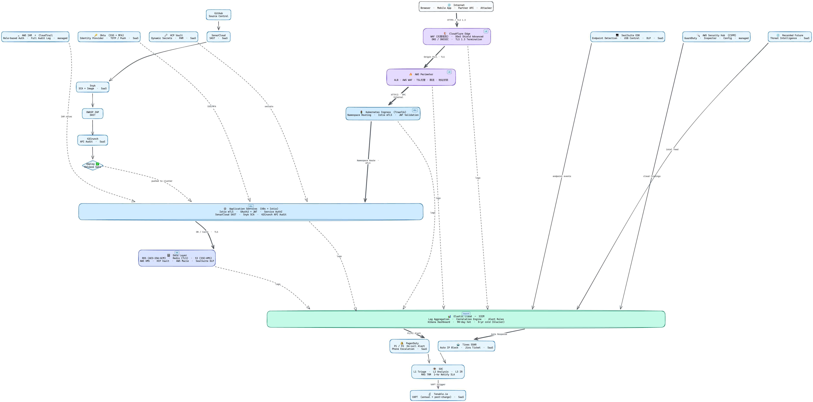

# Security Architecture

**MAS TRM 2021 · PDPA · PCI DSS v4.0**

---

## Architecture Diagrams

### Overall Architecture


### Security Tooling — Traffic Flow


---

## Repository Structure

```
architecture/
  overall-architecture.png          ← Full security architecture
  security-tools.png                ← Security tooling by layer

security-implementation-guide/
  01-边界安全.md                     ← Perimeter Security    (MAS TRM §9)
  02-内网安全.md                     ← Network Security      (MAS TRM §9)
  03-数据安全.md                     ← Data Security         (MAS TRM §13 · PDPA · PCI DSS)
  04-身份与访问管理.md                ← IAM                   (MAS TRM §10)
  05-安全运营.md                     ← Security Operations   (MAS TRM §12 · §14)

mas-trm/
  MAS TRM Guidelines.pdf            ← MAS TRM 2021 source
```

---

## Tooling Stack  (SaaS & Managed Only)

**Perimeter** — Cloudflare WAF · DDoS Shield · AWS WAF (OWASP CRS) · AWS Shield Adv · ACM

**Network** — Traefik · Istio mTLS · JWT Validation

**AppSec** — SonarCloud · Snyk · OWASP ZAP · 42Crunch

**Data** — AWS KMS · HCP Vault · AWS Macie · SealSuite DLP

**IAM** — Okta SSO/MFA · HCP Vault (PAM) · AWS IAM · CloudTrail

**SecOps** — Elastic Cloud SIEM · SealSuite EDR · AWS Security Hub · Recorded Future · PagerDuty · Tines SOAR · Tenable.io

**GRC** — Vanta · Cobalt.io · Trustwave · Jira Cloud

---

*Singapore Financial Services — MAS regulated environment*
